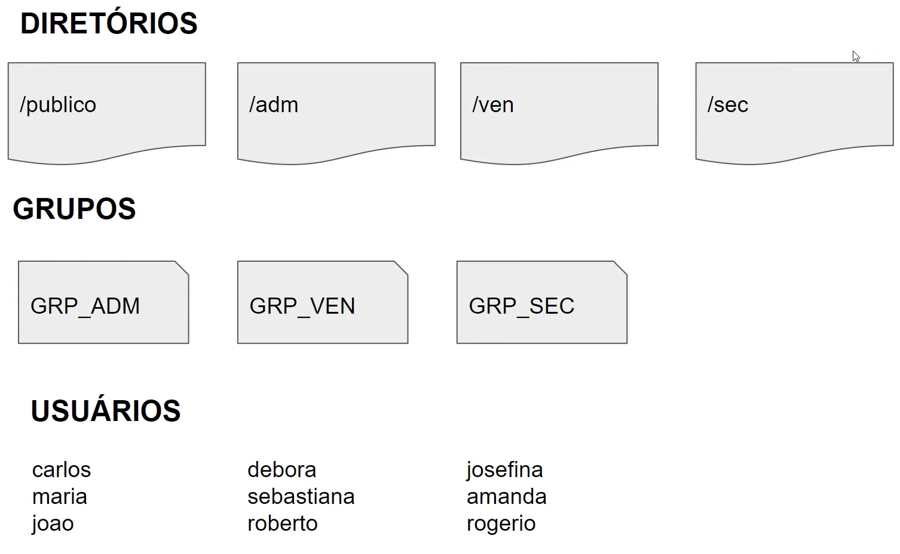

# PROJETO 1 - Infraestrutura como código - Bootcamp Cloud DevOps Experience - Banco Carrefour

O script presente neste repositório é responsável por implementar a infraestrutura descrita na imagem abaixo:

Implementando as seguintes regras:

1. O dono de todos os diretórios criados devem ser o usuário root
2. Todos os usuários terão permissão total dentro do diretório público
3. Os usuários de cada grupo terão permissão total dentro do seu respectivo diretório
4. Os usuários não poderão ter permissão de leitura, escrita e execução em diretórios que eles não pertencem
